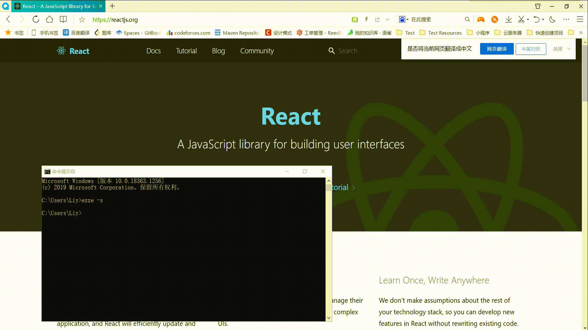

## ezze

一个翻译命令行.👻

### 安装
```
npm install -g ezze
```

### 配置
翻译功能目前依赖于百度翻译，需要用户在[百度翻译](https://fanyi-api.baidu.com/)申请appkey和secret，之后在`/data/.ezze_config.json`中填写appkey和secret
```json
{
  "baidu": {
    "appid": "appkey",
    "secret": "secret"
  }
}
```

### 使用

#### 命令行翻译
```
> ezze "A JavaScript library for building user interfaces"

// 输出
[==========]

A JavaScript library for building user interfaces

用于构建用户界面的JavaScript库
----------------------------
```

```
> ezze "用于构建用户界面的JavaScript库"

// 输出
[==========]

用于构建用户界面的JavaScript库

JavaScript library for building user interface
----------------------------------------------
```

#### 截图翻译
```
ezze -s
```

- mac 下暂时只支持使用 nvm 管理 node 版本的
- windows 下暂时只支持直接安装 node 的




